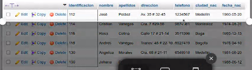

# Consusta_SQL
Introduccion a SQL

## Base de datos: Ventas
## Tablas: Clientes

-Nota: Los pantallasos son rob ados de usted profe por que no tenia tabla por el cambio de equipos PC.
## Instrucción SELECT
- Permiteseseclaccionar datos de una tabla.
- Su formato es 

### Consulta N°.1

1. Para visualizar toda la informacion que todo la tabla de Clientes se puede concluir con uno de los campos de la tabla.

- 'SELECT *FROM Cliente´
- 'SELECT identificación, nombre, apellidos, dirreccion, telefono,ciudad_nac,fecha nac FROM Cliente'

### Consulta N°.2

2. Para visualizar solamente la indentificacion de Cliente: 'SELECT indentifficación FROM Cliente'

### Consulta N°3

3. Si se desea obtener los registro mayor o igual  a 150, se debe utilizar la cláusula 'WHERE' que especifica las condiciones que se deban seleccionar : 'SELECT * FROM cLIENTES WHERE indentificacion=150'

### Consulta N°4

4. Se desea obtener los registris cuyo apellidos sean vagegas o cetina, se debe utulizar el operador  'IN' que especificael refistro que se debe especificae e los registros de la tabla.

'SELECT apellidos, nombre, FORM Cliente M-ERE apellidos, - "vegas" OR apellidos - "Cetina"

### Consulta N°5

5. Se desea obtener los registros menor a 110 y la ciudad sea cali, se debe usar el operador 'AND' 'SELEC *fORM Cliente WHERE indentificaciom <=110 AND ciudad - 'Cali''

### Consulta N°6

6. Si se desea obterner los registros segun el nsegun la letra "A" se usa el operador 'LIKE' que utiliza los patrones.

'SELEC *FROM Cliente Where nombre LIKE'

### Consulta N°7

7. Se deseaa que los registros que tengan cuyos nombres tengan la letra 'a' 

'SELECT * FROM Cliente WHERE nombre LIKE '%a%''

### Consulta N°8

8. Se desea obtener los registros donde la cuarta letra  del nombre es 'a'

'SELECT * FROM Cliente Where nombre LIKE '___a''

### Consulta N°9

9. SI se desea obtener los registros cuya identificacion este entre los intervalos 110 y 150, se debe utilizar la cláusula 'BETWEEN', que sirve para especificar un intervalo de valores.

'SELECT * From Cliente WHERE indentificacion 'BETWEEN 110 AND 150'

## Instrucción DELETE

- Permite borrar todos o un grupo específico de registros de una tabla.
- Su formato 'DELETE FROM nombre tabla'

### Eliminación N°1

1. Eliminar los registros cuya identificación  > 170.

'DELETE FROM Cliente WHERE indentificacion > 170'

### Eleminación N°2

2. 